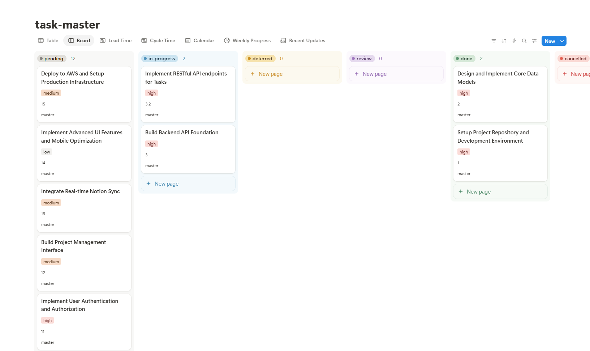
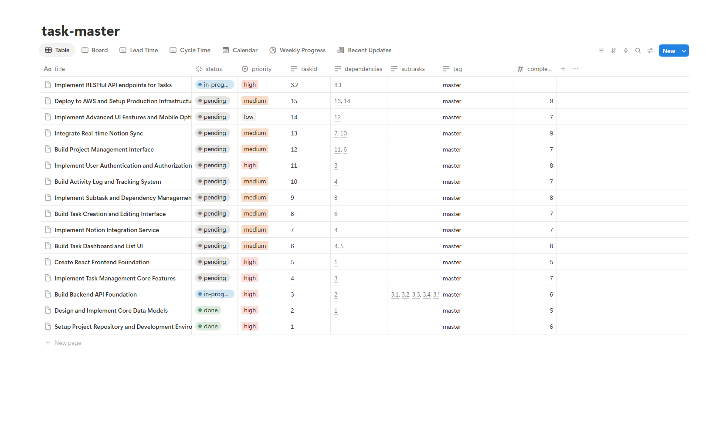
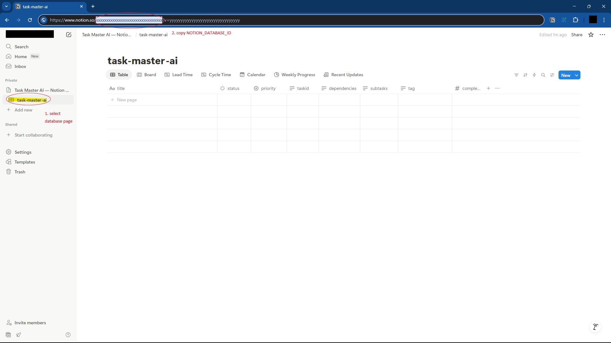

# Task Master - Notion Sync

This project is a fork of [eyaltoledano/claude-task-master](https://github.com/eyaltoledano/claude-task-master).
It extends the local task management features of Task Master by synchronizing your tasks to Notion, allowing you to leverage Notion's powerful database tools for visualization and management.




## Features

- Dump all Task Master tasks into a Notion database.
- Use Notion's Kanban board, timeline, calendar, and other views for your tasks.
- Add rich notes and details to each task page in Notion for enhanced productivity.

## Usage

For basic installation and setup, refer to the [original documentation](https://github.com/eyaltoledano/claude-task-master?tab=readme-ov-file#documentation).

### Additional Setup for Notion Sync

#### 1. Installation

**Local installation:**
1. Clone the repo:
   ```sh
   git clone https://github.com/chun92/claude-task-master
   ```
2. Install dependencies:
   ```sh
   npm install --save-dev shx
   npm link
   ```
   **Note:** This will override any existing task-master installation.
3. After running `task-master init`, set the following in your `.env` file:
   ```env
   NOTION_TOKEN=secret_xxx
   NOTION_DATABASE_ID=...
   ```

**npm installation:**
* (Not yet available; installation address will be updated soon.)

#### 2. Notion Setup

1. Create a Notion Integration at [Notion Integrations](https://www.notion.so/profile/integrations).
   - Set content capabilities: **Read content**, **Update content**, **Insert content**.
   - Use the Internal Integration Secret as your `NOTION_TOKEN`.
2. Import the Notion template from the Marketplace to your workspace: [Claude Task Master Notion Template](https://www.notion.com/ko/templates/claude-task-master).
   - On the imported page, set the Integration's Connections ([see guide](https://www.notion.com/help/add-and-manage-connections-with-the-api)).
   - Set the inline database's ID as `NOTION_DATABASE_ID`.
     - The database ID can be found in the Notion page URL (e.g., `https://www.notion.so/xxxxxxxxxxxxxxxxxxxxxxxxxxxxxxxx`, use the part before any query string).
     - **Important:** Use the database ID, not the page ID.



#### 3. Updating for Existing Task Master Users

If you have a `tasks.json` from version 0.20.0 or later, you can use it directly. (Migration from older versions is not guaranteed.)
All updates to tasks in your project will be processed in bulk.


## 4. Notion Sync

After completing all setup, when you run Task Master commands such as `parse-prd`, `update`, `analyze-complexity`, or `set-status` to update the state of your tasks, those tasks will be automatically synced to Notion.

## Cautions

- It is recommended to use this tool from the console.
- MCP mode is supported, but some issues may occur during testing.
- Installing this repo will override your existing task-master installation. **Backup your `tasks.json` before use.** The author is not responsible for lost data.
- As of v0.20.0:
  - MCP may create duplicate tasks or use legacy formats unpredictably in multi-tag environments.
  - If using MCP, avoid using tag features. Promoting subtasks to tasks may cause dependency issues.
- If you need to update a large amount of data to Notion, be aware that Notion API rate limits and bulk update reliability have not been fully tested. Failures may occur in such cases.

## Version Support

| Original Version | Notion Sync Support |
|------------------|--------------------|
| v0.20.0          | Supported          |
| Earlier versions | Not supported      |

This fork will continue to track and update for versions after v0.20.0.

## License

Task Master is licensed under the MIT License with Commons Clause. See the [LICENSE](LICENSE) file for details.

## Original Authors & Contributors

- [@eyaltoledano](https://x.com/eyaltoledano)
- [@RalphEcom](https://x.com/RalphEcom)
- [@jasonzhou1993](https://x.com/jasonzhou1993)
- See [contributors](https://github.com/eyaltoledano/claude-task-master/graphs/contributors)
